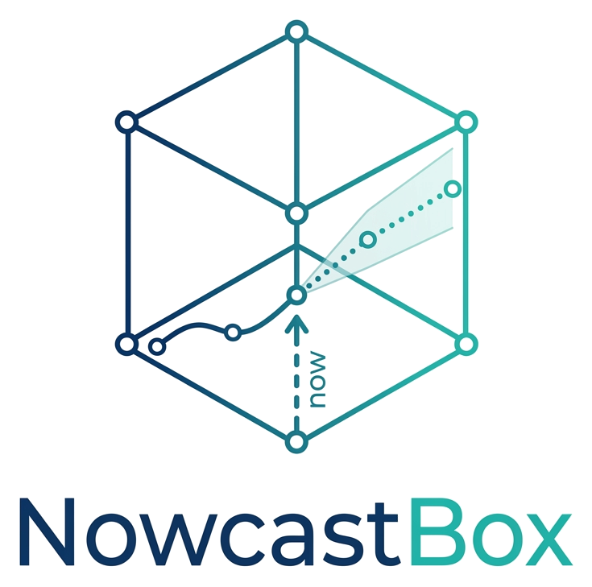

# NowcastBox

<p align="center">
  
</p>

**Nowcasting with dynamic factor models in Python.**

NowcastBox estimates the present, the recent past and the near future of low-frequency
macroeconomic variables (GDP above all) from large panels of monthly, quarterly and
higher-frequency indicators released with different delays. It covers the whole
workflow:

```
data -> transformations -> vintages -> factor selection -> estimation -> nowcast
     -> news decomposition -> density -> real-time evaluation -> diagnostics -> report
```

!!! warning "Pre-alpha"
    NowcastBox is under active development (0.2.0). The API
    documented here is tested on every commit, but names may still change before 1.0.
    New in this release cycle: the declarative pipeline and command-line interface
    ([Pipeline and CLI](user-guide/pipeline-cli.md)) and calendar-aware weekly/daily
    aggregation ([Aggregation and frequencies](user-guide/data/aggregation.md)).

## Features

<div class="grid cards" markdown>

-   **Mixed-frequency data**

    `MixedFrequencyData`: a contiguous base `PeriodIndex`, quarterly values in the
    third month of the quarter, per-series metadata (frequency, transformation,
    publication delay, blocks, category). Ragged-edge masks and pseudo real-time
    `as_of`. [Learn more](user-guide/data/mixed-frequency-data.md)

-   **Classical estimators**

    Two-step DFM (Giannone, Reichlin & Small, 2008), mixed-frequency EM DFM with blocks
    and AR(1) idiosyncratic components (Bańbura & Modugno, 2014), bridge equations,
    Bai-Ng criteria. [Learn more](user-guide/models/two-step-dfm.md)

-   **Real-time workflow**

    Release calendars, pseudo real-time vintages, real vintages with revisions
    (Brazilian GDP, ALFRED), backtests by nowcast horizon with benchmarks and
    Diebold-Mariano / Giacomini-White / MCS tests.
    [Learn more](user-guide/evaluation/backtesting.md)

-   **Explainability and uncertainty**

    News decomposition by series, block and category, nowcast tracker, level
    contributions, density nowcasts scored by CRPS, log score and PIT.
    [Learn more](user-guide/news/news-decomposition.md)

</div>

## Innovations

What NowcastBox adds to the R package `nowcasting` and to `statsmodels`'
`DynamicFactorMQ` (plan §3.2). Status for the 0.2.0 release; 0.2.0 also adds the features of the ECB Nowcasting Toolbox (see the [changelog](changelog.md)).

| # | Innovation | What it delivers | Status | Where |
|---|---|---|---|---|
| I1 | Arbitrary frequencies | Daily, weekly, monthly, quarterly and annual series in one model; generic aggregation constraints (flow, stock, average, Mariano-Murasawa), calendar-aware weights for D→M, W→Q... | Done for the EM model (two-step, bridge and benchmarks: fixed-ratio pairs M/Q/A) | [Aggregation](user-guide/data/aggregation.md) |
| I2 | Scalable EM | Univariate Kalman treatment, collapsed observations, exact structured smoother; about 12× faster per EM iteration than `DynamicFactorMQ` at N = 200 | Done | [Performance](user-guide/performance.md) |
| I3 | Robustness | Student-t idiosyncratic errors, automatic outlier detection inside the EM, pandemic mask/dummies, excluded periods | Done | [Robust estimation](user-guide/models/robust.md) |
| I4 | Time-varying long-run mean | Random-walk long-run mean of GDP growth (Antolin-Diaz, Drechsel & Petrella, 2017) | Done | [Long-run mean](user-guide/models/long-run-mean.md) |
| I5 | Density nowcasts | Predictive distribution with filtering and parameter (bootstrap) uncertainty; CRPS, log score, PIT, coverage tests | Done | [Density nowcasts](user-guide/density/density-nowcasts.md) |
| I6 | Explainability | News by series/block/category, revisions vs. new releases, nowcast tracker, contributions to the level | Done | [News](user-guide/news/news-decomposition.md) |
| I7 | Variable selection | Targeted predictors (hard/soft thresholding, elastic net); block and variable selection validated in pseudo real time | Done | [Targeted predictors](user-guide/selection/targeted-predictors.md) |
| I8 | Real vintages | `VintageStore` with `as_of(date)`, Brazilian GDP vintages (IBGE), ALFRED | Partial: IBC-Br vintages pending | [Real-time vintages](user-guide/vintages/real-vintages.md) |
| I9 | DFM diagnostics | Loading stability (Breitung-Eickmeier), EM convergence, commonality, residual tests, data quality | Done | [Diagnostics](user-guide/diagnostics.md) |
| I10 | Production pipeline | YAML specification, `nowcastbox` CLI, versioned snapshots, HTML reports | Done | [Pipeline and CLI](user-guide/pipeline-cli.md) |
| I11 | Interoperability | Any scikit-learn regressor as a backtest benchmark; Parquet export | Done | [Benchmarks](user-guide/models/benchmarks.md) |

## Quickstart

```python
import nowcastbox as nb

# Brazilian panel (BCB, IBGE, IPEA) in levels, with legend, delays and blocks
ds = nb.load_brazil_nowcast(
    columns=["pib", "ibc_br", "pim_geral", "pmc_varejo", "pms_volume", "ipca", "selic"],
    start="2012-01",
    end="2024-12",
)

# stationary transformations from the legend, outliers and interior gaps
panel = nb.prepare_panel(ds.data, ds.transform, keep="pib")

# the data as they were known on 15 November 2024 (publication delays)
vintage = nb.pseudo_real_time(panel, delay=ds.delay, vintage="2024-11-15")

# mixed-frequency dynamic factor model estimated by EM
res = nb.MixedFreqDFM(n_factors=1).fit(vintage, target="pib")
print(res.summary())
res.nowcast.tail()  # observed / in_sample / out_of_sample (+ std, 68 % / 90 % bands)
```

Continue with the [quickstart](getting-started/quickstart.md), the
[core concepts](getting-started/core-concepts.md) and the
[user guide](user-guide/index.md). The [theory](theory/index.md) section derives every
method with the notation used in the code.

## Related work

NowcastBox is an independent, MIT-licensed implementation written from the academic
literature. It is inspired by the R package
[`nowcasting`](https://github.com/nmecsys/nowcasting) (de Valk, de Mattos & Ferreira,
2019) and relates to `statsmodels.tsa.DynamicFactorMQ` and the FRBNY Staff Nowcast
code; these are used only as external benchmarks of results (see
[Comparison](comparison/r-nowcasting.md)).

## Authors

Gustavo Haase and Alexandre Leão Sanches — Programa de Pós-Graduação em Economia,
Universidade Católica de Brasília (UCB).
